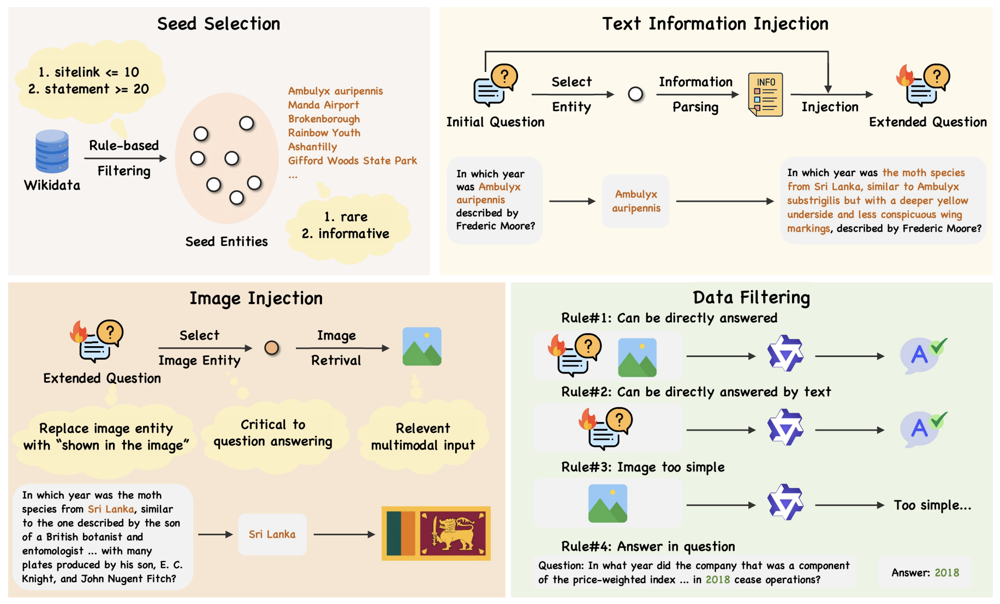
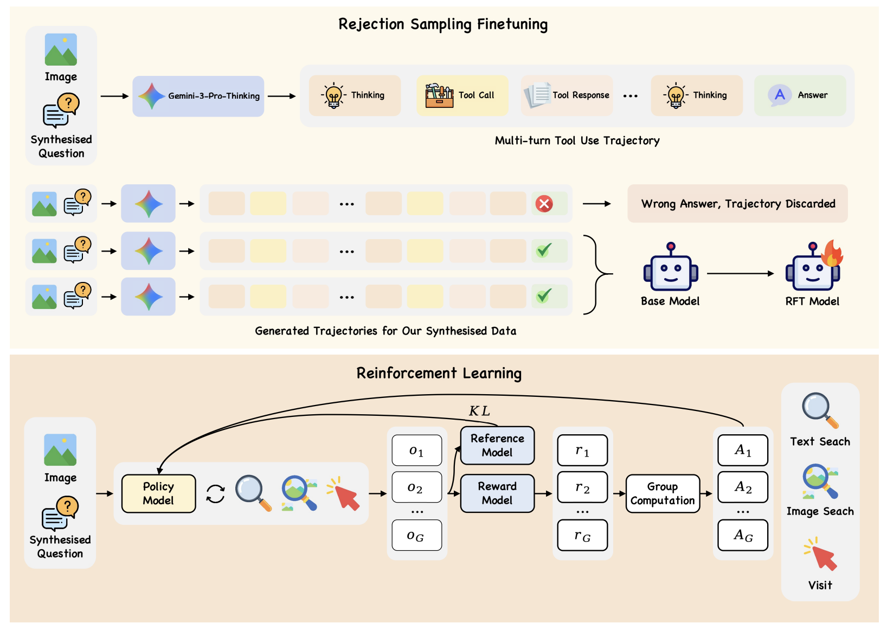

# VSearcher: Long-Horizon Multimodal Search Agent via Reinforcement Learning

## 🌟 Abstract

Large models are increasingly becoming autonomous agents that interact with real-world environments and use external tools to augment their static capabilities. However, most recent progress has focused on text-only large language models, which are limited to a single modality and therefore have narrower application scenarios. On the other hand, multimodal large models, while offering stronger perceptual capabilities, remain limited to static knowledge and lack the ability to access and leverage up-to-date web information. In this paper, we propose VSearcher, turning static multimodal model into multimodal search agent capable of long-horizon, multi-turn tool use in real-world web environments, including text search, image search, and web browsing, via reinforcement learning. Specifically, we introduce Iterative Injection Data Synthesis pipeline to generate large-scale, complex multimodal QA questions, which are further filtered with comprehensive metrics to ensure high quality and sufficient difficulty. We then adopt an SFT-then-RL training pipeline to turn base multimodal models to agent capable of multi-turn tool calling in real-world web environments. Besides, we propose a multimodal search benchmark MM-SearchExam dedicated to evaluating search capabilities of multimodal search agents, which proves highly challenging for recent proprietary models. Extensive evaluations across multiple multimodal search benchmarks reveal effectiveness of our method. VSearcher achieves superior performance compared to recent multimodal search agents and even surpasses several proprietary models on multimodal web search tasks.

## 📝 Iterative Injection-based Data Synthesis



## 💻 Rejection Sampling Finetuning \& Reinforcement Learning



## ⚒️ Environment

```bash
conda create -n VSearcher python=3.10
conda activate VSearcher
pip install vllm==0.11.0 google-cloud-vision beautifulsoup4 transformers openai
```

Please follow the instruction in [LlamaFactory](https://github.com/hiyouga/LlamaFactory) to set up environment for LlamaFactory.

## 💾 Data Synthesis

Obtain less-known seed entities from wikidata, serving as initial seeds for following up synthesis process.

```bash
python data_synthesis/obtain_seed.py --limit 150000 --sitelinks_max 10 --min_statements 20 --result_path data_synthesis/seed/wikidata_less_known_150k_10_20.jsonl
```

Set up an offline wikipedia service for entity information query.

```bash
mkdir -p data_synthesis/wikipedia_data
wget https://dumps.wikimedia.org/kiwix/zim/wikipedia/wikipedia_en_all_maxi_2025-08.zim -P data_synthesis/wikipedia_data

mkdir -p data_synthesis/kiwix
wget https://download.kiwix.org/release/kiwix-tools/kiwix-tools_linux-x86_64-3.8.1.tar.gz -P data_synthesis/kiwix
tar xf data_synthesis/kiwix/kiwix-tools_linux-x86_64-3.8.1.tar.gz -C data_synthesis/kiwix
./data_synthesis/kiwix/kiwix-tools_linux-x86_64-3.8.1/kiwix-serve --port=8080 data_synthesis/wikipedia_data/wikipedia_en_all_maxi_2025-08.zim
```

Run the data synthesis process. For easy, medium, hard browsing tasks, we conduct 1 round, 3 rounds, 5 rounds of injection process respectively. The detailed synthesis process is saved in data_synthesis/log, and synthesized browsing tasks are saved in data_synthesis/data.

```bash
export CUDA_VISIBLE_DEVICES=0,1,2,3; vllm serve Qwen/Qwen2.5-72B-Instruct --port 8000 --tensor-parallel-size 4 --gpu-memory-utilization 0.8

export CUDA_VISIBLE_DEVICES=4,5,6,7; vllm serve Qwen/Qwen2.5-VL-72B-Instruct --port 8001 --tensor-parallel-size 4 --gpu-memory-utilization 0.8

mkdir -p data_synthesis/data
mkdir -p data_synthesis/log

python data_synthesis/data_synthesis.py --seed_path data_synthesis/seed/wikidata_less_known_50k_10_20_for_easy.jsonl --n_iteration 1 --result_path data_synthesis/data/easy.jsonl 2>&1 | tee data_synthesis/log/easy_$(date +"%Y%m%d_%H%M%S").log

python data_synthesis/data_synthesis.py --seed_path data_synthesis/seed/wikidata_less_known_50k_10_20_for_medium.jsonl --n_iteration 3 --result_path data_synthesis/data/medium.jsonl 2>&1 | tee data_synthesis/log/medium_$(date +"%Y%m%d_%H%M%S").log

python data_synthesis/data_synthesis.py --seed_path data_synthesis/seed/wikidata_less_known_50k_10_20_for_hard.jsonl --n_iteration 5 --result_path data_synthesis/data/hard.jsonl 2>&1 | tee data_synthesis/log/hard_$(date +"%Y%m%d_%H%M%S").log
```

Run the data filtering process. We devise 4 data filtering metrics to ensure both high quality and high difficulty of our synthesized browsing tasks.
```bash
python data_synthesis/data_filtering.py --data_path data_synthesis/data/easy.jsonl --labeled_data_path data_synthesis/data/labeled_easy.jsonl --filtered_data_path data_synthesis/data/filtered_easy.jsonl

python data_synthesis/data_filtering.py --data_path data_synthesis/data/medium.jsonl --labeled_data_path data_synthesis/data/labeled_medium.jsonl --filtered_data_path data_synthesis/data/filtered_medium.jsonl

python data_synthesis/data_filtering.py --data_path data_synthesis/data/hard.jsonl --labeled_data_path data_synthesis/data/labeled_hard.jsonl --filtered_data_path data_synthesis/data/filtered_hard.jsonl
```

## 💬 Inference

- For text search, we use Serper. Please visit [Serper](https://serper.dev/) to obtain your search key.
- For image search, we use Google Cloud web detection service. Please follow [this link](https://docs.cloud.google.com/vision/docs/detecting-web?hl=zh-cn#vision_web_detection-python) to set up the search api. You should also follow [this link](https://docs.cloud.google.com/iam/docs/keys-create-delete?hl=zh-cn#creating) to obtain the search key. The search key is a json file, which should be downloaded to local.
- For visit, we use JINA. Please visit [JINA](https://jina.ai/) to obtain your api key.

Set up api key for tools.

```bash
export SERPER_KEY="xxxxxxxxxxxxxxxxxxxxxxxxxx"

export GOOGLE_APPLICATION_CREDENTIALS="xxxxxxxxxxxxxxxxxxxxxxxxxx.json"

export JINA_KEY="jina_xxxxxxxxxxxxxxxxxxxxxxxxxx"
```

Download our model at [Ruiyang-061X/VSearcher-8B](https://huggingface.co/Ruiyang-061X/VSearcher-8B).

```bash
hf download Ruiyang-061X/VSearcher-8B
```

Run ReAct inference process on single browsing task.

```bash
export CUDA_VISIBLE_DEVICES=0,1,2,3; vllm serve Qwen/Qwen2.5-72B-Instruct --port 8000 --tensor-parallel-size 4 --gpu-memory-utilization 0.8

export CUDA_VISIBLE_DEVICES=4; vllm serve Ruiyang-061X/VSearcher-8B --port 9000 --gpu-memory-utilization 0.8

python -m inference.react_agent 2>&1 | tee inference/react_agent.log
```

Evaluate on specific benchmark. Model trajectory is saved in inference/result. The detailed inference log is saved in inference/log.

```bash
mkdir -p inference/result
mkdir -p inference/log

python -m inference.evaluation --model Ruiyang-061X/VSearcher-8B --api_key EMPTY --base_url http://127.0.0.1:9000/v1 --benchmark_jsonl_path mmsearcheaxm/mmsearchexam.jsonl --result_jsonl_path inference/result/mmsearchexam.jsonl 2>&1 | tee inference/log/mmsearchexam_$(date +"%Y%m%d_%H%M%S").log
```

## 🔧 Rejection Sampling Finetuning

Rejection sampling on model trajectory based on final answer correctness.

```bash
python -m rejection_sampling_finetuning.rejection_sampling --trajectory_jsonl_path trajectory.jsonl  --output_jsonl_path rejection_sampled_trajectory.jsonl
```

Convert model trajectory into llamafactory SFT dataset format.

```bash
python -m rejection_sampling_finetuning.convert_to_llamafactory_dataset --trajectory_jsonl_path rejection_sampled_trajectory.jsonl --output_path rft_data.json
```

We have provided rejection sampled trajectories from Gemini-3-Pro in rejection_sampling_finetuning/LlamaFactory/data/trajectory.json. Use the following scripts to conduct RFT on Qwen3-VL-8B-Thinking with those trajectories.

```bash
export CUDA_VISIBLE_DEVICES=0,1,2,3,4,5,6,7

llamafactory-cli train examples/train_full/qwen3vl_8b_full_sft.yaml 2>&1 | tee logs/qwen3vl_8b_full_sft_$(date +%Y%m%d_%H%M%S).log

llamafactory-cli export examples/merge_lora/qwen3vl_8b_full_sft.yaml
```

## 📊 MM-SearchExam

We also provide MM-SearchExam, a highly challenging multimodal web browsing benchmark including 283 samples. The benchmark data is at mmsearcheaxm/mmsearchexam.jsonl. Below are two samples from MM-SearchExam.

```
{"question": "In which administrative district is the village located 3 km northeast of a town that was the site of a forced labor camp for Jewish men and a subcamp of a concentration camp that initially was a satellite of the one shown in the image, became an independent camp in 1941 and expanded to include up to 100 subcamps, primarily using Jewish, Polish, and Soviet prisoners for labor in quarries and German war industries, and includes the towns of Świebodzice, Strzegom, Jaworzyna Śląska, and Żarów, that expanded its boundaries in 2016 to include part of the village of Mrowiny, 14 km northeast of a city with nearly a millennium of history, once the capital of a Piast-ruled duchy and a renowned brewing center, with its beer served in cities across Europe, and 42 km southwest of a city with a rich multicultural heritage, serving as the capital of the Lower Silesian Voivodeship in southwestern Poland, known for landmarks such as the Centennial Hall, a UNESCO World Heritage Site, and the Wrocław Dwarfs, bronze figurines that are a major tourist attraction?", "image_path": "https://raw.githubusercontent.com/image-storage-rl/image_storage/refs/heads/main/data_synthesis/35549701bb10_Prisoners_in_the_concentration_camp_at_Sachsenhausen_2C_Germany_2C_12-19-1938_-_NARA_-_540175__cleanup_.jpg", "answer": "Gmina Żarów"}

{"question": "What is the name of the railway station situated in a borough that borders a city known for a company that introduced aspirin in 1899 and heroin as a non-addictive morphine substitute in 1898? This city also has a sports club, which was initially a works team and part of TSV Bayer 04 shown in the image before separating in 1999 to become a subsidiary of the same company, making it one of only two exceptions to the 50+1 rule in German football. The station serves as a hub for regional and S-Bahn traffic in the northeastern part of the largest city in North Rhine-Westphalia, which was heavily bombed during World War II, reducing its population by 93% and destroying around 80% of the city center.", "image_path": "https://raw.githubusercontent.com/image-storage-rl/image_storage/refs/heads/main/data_synthesis/936d770d6fc5_Pano-bayer-leverkusen.jpg", "answer": "Köln-Mülheim station"}
```

## 📎 Citation

```bib
@article{zhang2024vsearcher,
  title={VSearcher: Long-Horizon Multimodal Search Agent via Reinforcement Learning},
  author={Zhang, Ruiyang and Sun, Qianguo and Song, Chao and Qi, Yiyan and Zheng, Zhedong},
  journal={arXiv preprint},
  year={2026}
}
```
